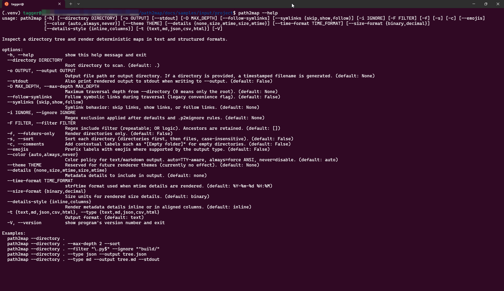
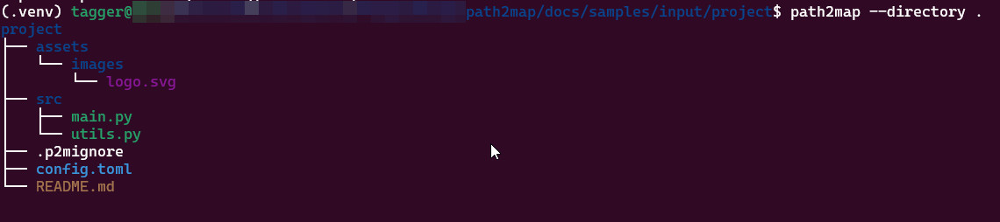

# Sample Usage Workspace

This directory is a runnable workspace for demonstrating `path2map` features.

## Layout

- `input/project/`:
  - sample directory tree used for commands
- `output/`:
  - generated sample outputs (text, md, json, csv, html)
- `commands.sh`:
  - reference commands covering major CLI flags and output types

## Run Samples

From repository root:

```bash
source .venv/bin/activate
bash docs/samples/commands.sh
```

This generates output files under `docs/samples/output/`.

## Screenshots

Help output preview:



Sample text tree preview:



## Output Index

- CLI reference:
  - [Help output](output/help.txt)
  - [Version output](output/version.txt)
- Core output types:
  - [Text](output/tree.text.txt)
  - [Markdown](output/tree.md)
  - [JSON](output/tree.json)
  - [CSV](output/tree.csv)
  - [HTML](output/tree.html)
- Feature-focused examples:
  - [Depth + ignore + filter](output/tree.filtered.txt)
  - [Folders-only + sort + comments + emojis](output/tree.folders.txt)
  - [Details formatting (size/mtime, custom time format, columns)](output/tree.details.txt)
  - [Theme flag example](output/tree.theme.txt)
  - [Symlinks show mode](output/tree.symlinks-show.txt)
  - [Symlinks follow mode](output/tree.symlinks-follow.txt)
  - [Legacy --follow-symlinks flag](output/tree.follow-legacy.txt)

## Coverage Summary

`docs/samples/commands.sh` includes at least one runnable example for:

- Output formats: `text`, `md`, `json`, `csv`, `html`
- Traversal/filtering: `--max-depth`, `--ignore`, `--filter`
- Rendering toggles: `--folders-only`, `--sort`, `--comments`, `--emojis`
- Details/style: `--details`, `--time-format`, `--size-format`, `--details-style`
- Symlinks: `--symlinks`, `--follow-symlinks`
- Output routing: `--output`, `--stdout`
- General CLI: `--help`, `--version`, `--theme`

## Notes

- Keep sample outputs deterministic and commit-friendly.
- Update this directory when CLI behavior or output schemas change.
